# 🌌 Hi there, I'm Sayan Som! 

  

  

  

---

### 🔮 About Me

I am a developer from India passionate about translating ideas into code. I specialize in combining **Artificial Intelligence** and **Data Science** models with **interactive web technologies**.

- 🔭 **Current Focus**: Designing user-friendly web apps and training predictive datasets.
- 🎓 **Studies**: Advanced Artificial Intelligence &amp; Data Science.
- ⚡ **Fun Fact**: I build mental health trackers to help improve developer wellness!
- ✉️ **Reach Me**: [sayansom625@gmail.com](mailto:sayansom625@gmail.com)

---

### 🛠️ Tech Stack

  

---

### 🎨 Featured Projects

<table width="100%">
  <tr>
    <td width="50%" valign="top">
      <h4>🧠 Mental Health Tracker</h4>
      
A responsive web app designed to log user mood patterns, track lifestyle activities, and visualize mental wellness indexes dynamically.

      <a href="https://github.com/Quantumboy80/mental-health-tracker"><b>View Repository →</b></a>
    </td>
    <td width="50%" valign="top">
      <h4>📈 Emotion Health Tracker</h4>
      
A clean, vanilla HTML/CSS/JS assistant for emotional tracking, mood analytics, and real-time reflection logs.

      <a href="https://github.com/Quantumboy80/Emotion-Health-Tracker"><b>View Repository →</b></a>
    </td>
  </tr>
  <tr>
    <td width="50%" valign="top">
      <h4>🧪 ColabProjects</h4>
      
Google Colab and Jupyter notebooks hosting my experiments in Artificial Intelligence, data preprocessing, and ML algorithms.

      
    </td>
    <td width="50%" valign="top">
      <h4>🥷 DevOps Ninjas Code</h4>
      
A collaborative workspace documenting pipelines, automation logic, and cloud environment setups.

      <a href="https://github.com/Quantumboy80/DevOpsNinjascode"><b>View Repository →</b></a>
    </td>
  </tr>
</table>

---

### ✍️ Interactive Guestbook

Want to leave your mark? Click the button below to sign my guestbook! A GitHub Action will automatically parse your submission, add your profile avatar, and display your message on my profile wall below.

  

<!-- START_GUESTBOOK -->
<table>
  <thead>
    <tr>
      <th width="25%">Visitor</th>
      <th width="60%">Message</th>
      <th width="15%">Date</th>
    </tr>
  </thead>
  <tbody>
    <tr>
      <td><a href="https://github.com/Quantumboy80"><b>@Quantumboy80</b></a></td>
      <td>💬 <i>Welcome to my interactive profile! Click the button above to sign my Guestbook and leave your mark! 🚀</i></td>
      <td><code>2026-07-12</code></td>
    </tr>
  </tbody>
</table>
<!-- END_GUESTBOOK -->

---

### 🎮 Contribution Snake Game (Animated)

This snake eats my contribution graph daily! (Generated automatically via GitHub Actions):

  

---

### 📊 GitHub Infographics & Metrics

<table width="100%">
  <tr>
    <td width="55%" valign="top">
      
    </td>
    <td width="45%" valign="top">
      
    </td>
  </tr>
  <tr>
    <td colspan="2" align="center" valign="top">
      
    </td>
  </tr>
  <tr>
    <td colspan="2" align="center" valign="top">
      
    </td>
  </tr>
</table>

---

### 🤝 Connect with Me

  
  &nbsp;&nbsp;
  

 

  

